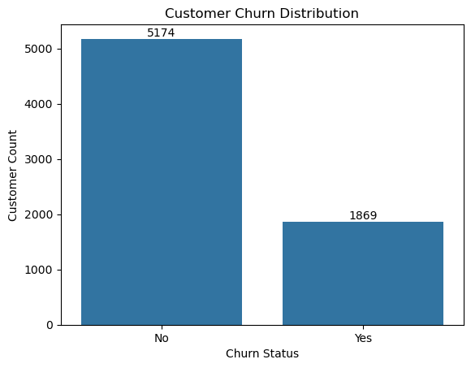
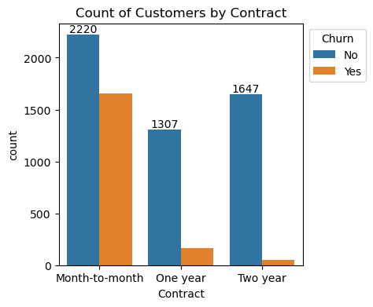
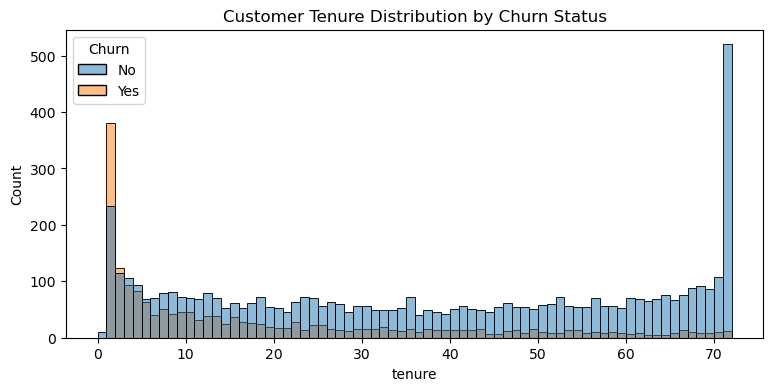
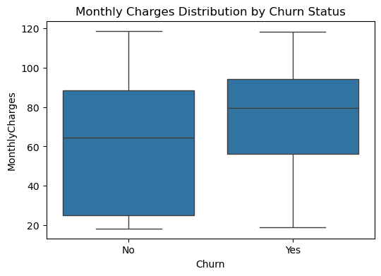

# 📊 Customer Churn Analysis (EDA & Business Insights)

## 🔍 Project Overview
This project performs an end-to-end Exploratory Data Analysis (EDA) on a telecom customer dataset to identify key factors influencing customer churn. The analysis focuses on customer behavior, service usage, contract types, tenure, payment methods, and billing patterns to generate actionable business insights for improving customer retention.

---

## 🎯 Objective
- Analyze customer churn patterns
- Identify key drivers of churn
- Perform data cleaning and exploratory data analysis (EDA)
- Generate data-driven business insights for customer retention strategies

---

## 📁 Repository Structure
```
customer-churn-analysis/
│
├── data/                     # Dataset used for analysis
├── images/                   # Key visualization outputs
├── Customer-Churn-Analysis.ipynb  # Main EDA notebook
└── README.md
```

---

## 📊 Dataset Information
- Dataset: Telco Customer Churn Dataset  
- Total Records: 7043 Customers  
- Total Features: 21 Columns  
- Target Variable: Churn (Yes/No)  
- Data includes customer demographics, services, billing, tenure, and contract details.

---

## 🛠️ Tools & Technologies Used
- Python  
- Pandas  
- NumPy  
- Matplotlib  
- Seaborn  
- Jupyter Notebook  

---

## 🧹 Data Cleaning & Preprocessing
- Handled missing values in `TotalCharges`
- Converted data types for accurate analysis
- Transformed `SeniorCitizen` from numerical (0/1) to categorical (No/Yes)
- Verified dataset consistency and structure

---

## 📈 Exploratory Data Analysis (EDA)
The analysis includes:
- Churn Distribution Analysis
- Demographic Analysis (Gender, Senior Citizen)
- Tenure vs Churn Analysis
- Contract Type vs Churn
- Payment Method vs Churn
- Monthly Charges vs Churn
- Correlation Analysis of Numerical Features

---

## 📊 Key Visual Insights

### Customer Churn Distribution


### Contract Type vs Churn


### Tenure Distribution by Churn Status


### Monthly Charges vs Churn


---

## 🔑 Key Insights & Findings
- Customers with **month-to-month contracts** show the highest churn rate.
- Customers using **electronic check** as a payment method are more likely to churn.
- Customers with **shorter tenure (low months)** have significantly higher churn.
- Higher **monthly charges** are associated with increased churn probability.
- Customers without value-added services like **OnlineSecurity and TechSupport** tend to churn more.

---

## 🧠 Correlation Analysis
The correlation heatmap indicates weak linear relationships among numerical features such as tenure, MonthlyCharges, and SeniorCitizen, suggesting that churn is influenced more by behavioral and service-related factors rather than strong numerical correlations.

---

## 💡 Business Recommendations
- Promote long-term contracts to improve customer retention
- Encourage customers to switch from electronic check to more secure payment methods
- Improve customer onboarding experience during early tenure
- Offer bundled services (TechSupport, OnlineSecurity) to reduce churn risk
- Monitor high monthly charge customers for proactive retention strategies

---

## 🚀 Project Outcome
Successfully identified major churn drivers using EDA and provided actionable insights that can help telecom companies design effective customer retention strategies and reduce customer attrition.

---

## ▶️ How to Run the Project
1. Clone the repository:
   ```bash
   git clone https://github.com/your-username/customer-churn-analysis.git
   ```
2. Navigate to the project folder:
   ```bash
   cd customer-churn-analysis
   ```
3. Install required libraries:
   ```bash
   pip install pandas numpy matplotlib seaborn
   ```
4. Open the Jupyter Notebook:
   ```bash
   jupyter notebook Customer-Churn-Analysis.ipynb
   ```

---

## 📌 Author
**Sakshi Gaur**  
Data Analyst | Python | Power BI | EDA | SQL  

---

## ⭐ If you found this project useful, consider giving it a star!
